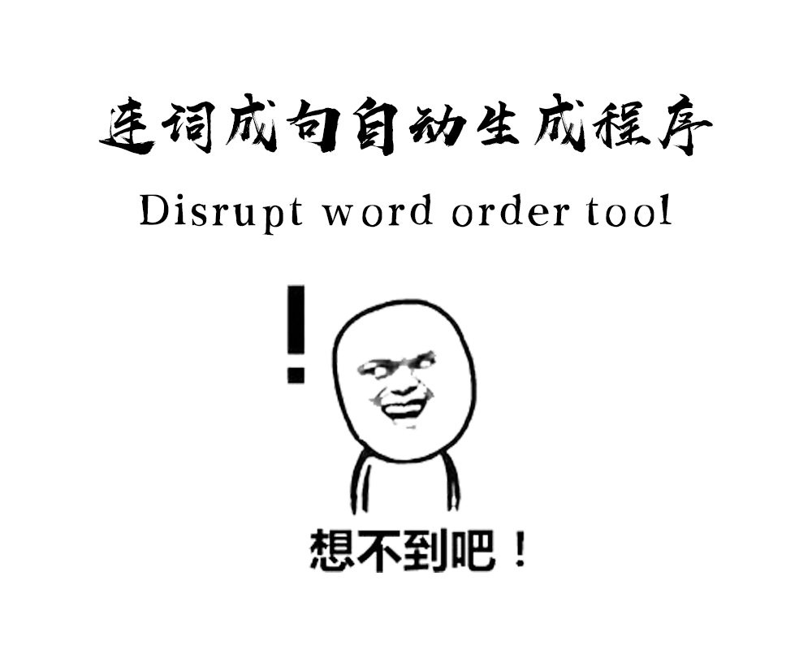
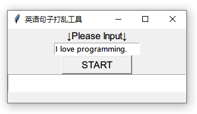
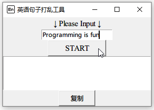

# Disrupt-word-order-tool/连词成句自动生成程序

此项目用以帮助教师等人快速编写题目祸害学生。使用Python及其标准库Tkinter进行编写。其中使用copy库进行深拷贝，使用random库打乱句子顺序
>已编译的```dwot.exe```: https://github.com/zymzs/Disrupt-word-order-tool/releases

## 使用

* Python 3
* pip / pip3


### 安装Pyinstaller

```
pip install pyinstaller
```

### 编译

使用 Pyinstaller 对``` graph.py ```进行编译

```
pyinstaller -Fw graph.py
```

### 使用示例

#### Windows



## 版本历史

* 0.2.5
    * 添加复制按钮。
    * 增加自动将焦点放在输入框上的功能。
    * TODO
        * 改进UI美观程度
        * 添加多种打乱方式（形式），如按字母排序等、如用户按照example自行指定格式等。

* 0.2.0
    * 增加文本框行数至5行。
    * 修复了生成时会出现原句的bug。
    * 做到了在生成句子时自动清空文本框。
    * TODO
        * 改进UI美观程度
        * 添加多种打乱方式（形式），如按字母排序等、如用户按照example自行指定格式等。

* 0.1.0
    * 底层代码基本完成。
    * 标准UI已完成。
    * TODO
        * 界面仍需优化。
        * Text的清除功能仍需添加。
        * 生成时会出现原句的bug需要修复。

## 作者

### zymzs
一个来自徐州市撷秀初级中学的初二学生。自学 Python 1年。
**仍需指点**

## 授权协议

这个项目遵循 GNU 协议， 请点击 [LICENSE](LICENSE) 了解更多细节。